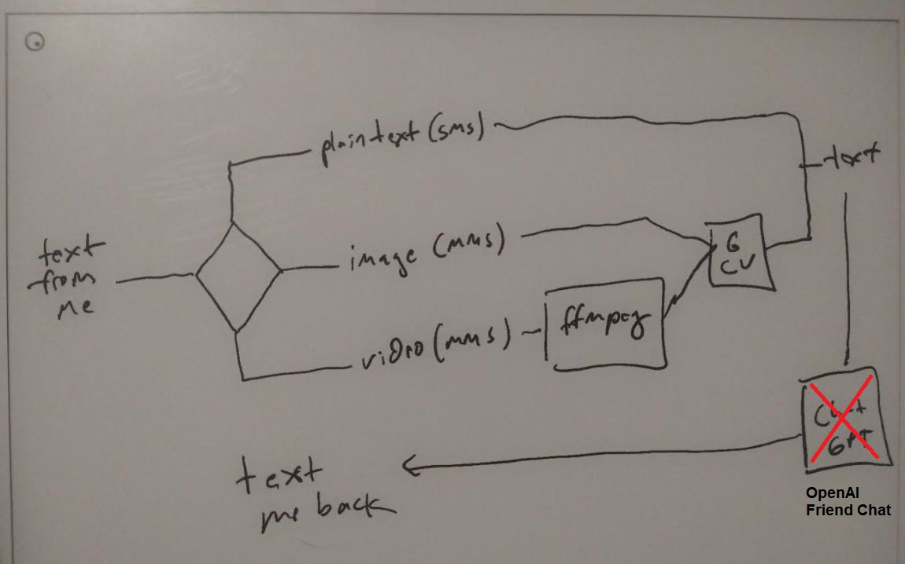
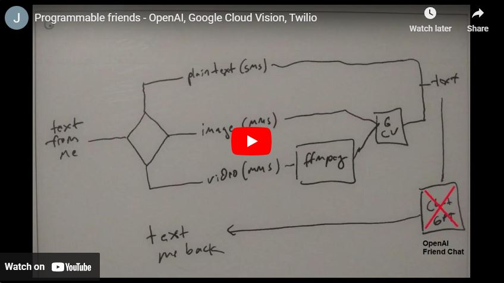

### About

This takes in an SMS/MMS and if the latter uses Googe Cloud Vision to infer what it is, to have something to talk about.

The conversation part uses OpenAI Friend Chat.

Uses Twilio for the communication mechanism.

### Basic block diagram of workflow

### Demo video (YouTube)

### Code flow

* **app.js** -- (receive forwarding request from Twilio SMS/MMS)
  * **methods.js** -- (process message from me if text, image, or video)
  * **google_cloud_vision.js** -- (get labels from image eg. person)
  * **openai_friend_chat.js** -- (send message to "AI" friend and get response back)
  * **twilio.js** -- (message me back)

### Getting started

You will need accounts:

* Twilio, OpenAI, Google Cloud Vision

You can run the individual bits locally or host it on a server.

In the latter case you'd need a webserver with an https-enabled domain and NodeJS running with FFMPEG installed.

### Disclaimer

This is not a free thing to run, it will cost you some money but not a lot.
