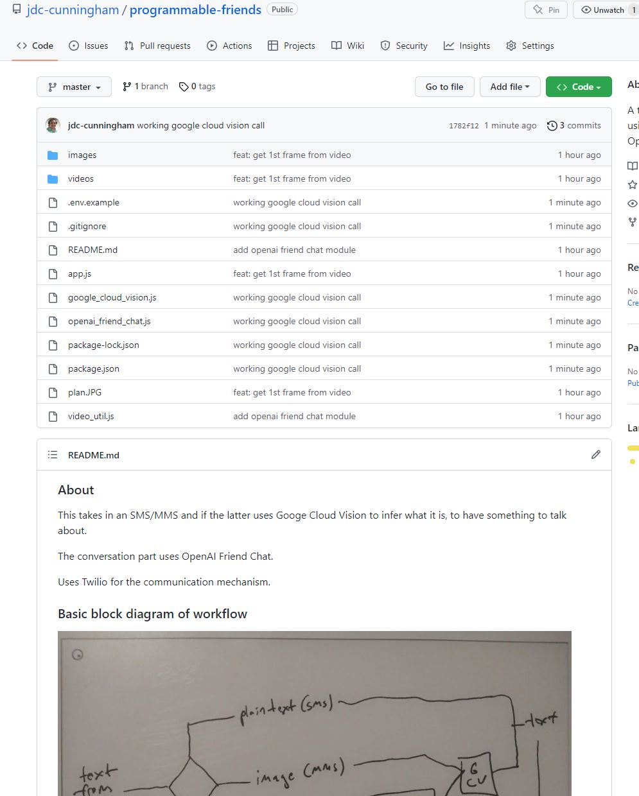
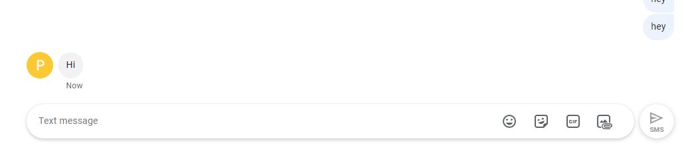

Sorry the format of this is f'd, I need a medium to MD exporter

Medium copy-paste below with fixed images

01/07/2023 11:38 AM
I did not sleep as well as I would have liked but here I am.

cleaned my keyboard, closed all my tabs, have these open, set FAH to light so I don't get cooked in my room, blank repo and coffee plus music

First a plan… this is not a hard project, again it's code gluing, not novel, you gotta eat the glue Jacob to be the glue.

It's pretty simple… just gotta build all these blocks and join them together. Twilio is not mentioned above but it is the transport mechanism.
Starting to write code now 11:52 AM
I have built many express-based web servers before and also used a NodeJS Twilio client before so that's straight forward.
I'll do the hard stuff (to me) first.
How to extract a frame out of a video using ffmpeg
I have a video and I want to extract 35-th frame out of this video. I want it to be a png image if possible. I know…superuser.com
I'll do the laziest stuff eg. only 1 frame pulled.
Let me look at a recent video I sent to one of my friends as an example of a video to pull a frame from. Yeah this is probably not going to work well lol, this one is an animated video. Okay I can do this one, guy wears his own exosuit to lift a kettlebell.
12:10 PM first problem, ffmpeg command throwing an error
12:16 PM okay past this blocker
12:23 PM back from brief break, coffee refill… mmm my Cherry Red MX keyboard Durgod Hades 68, feels good man
One semi-hard thing is the buffer to file but I've done that before with regard to file upload stuff in the past.
I think it's time for some Korn, I gotta get pumped, the 1994 Album.
12:32 PM doing the OpenAI Friend Chat part
Gotta get my terms right this is not ChatGPT.
Anyway example response block from the OpenAI Friend Chat:

id bit probably doesn't matter but tin foil hat yo12:40 PM next unknown is Google Cloud Vision
12:51 PM stuck figuring out what kind of auth to use for Google Cloud Vision
Using this article
Setting up Google Cloud Vision API with Node.js
A step-by-step guide on setting up authentication and how to use Google Cloud Vision API in Node.js to build a simple…medium.com
I've used a similar approach (service account) for my Google Spreadsheet stuff.
Damn this is annoying, so you look up "Google Credentials" to get to a generic page like this.
https://console.cloud.google.com/apis/credentials?project=your-project-id
Then click manage service accounts, this is not from the article above. The link in the article is old/takes you to this "list buckets" auth example.
1:04 PM Dang this way does not work… might have to use the OAUTH2 way like in the Google Spreadsheet way I use to acces.
Uh oh productivity loss

Gotta distract him with some tuna1:14 PM damn this auth is not working hmm
Trying this one
How to pass an api key to the Google Cloud Vision NodeJS API
Thanks for contributing an answer to Stack Overflow! Please be sure to answer the question. Provide details and share…stackoverflow.com
1:16 PM quick break, snack, can of NOS, clean keyboard, new album
1:25 PM back on, Follow The Leader
Okay so this uses an API key approach not a service account
1:33 PM nice got a successful call/response with Google Cloud Vision
Oh damn I hope I don't have to parse the labels/bounding boxes from the image that would be dumb lol (on my part).

Oh okay need to enable billing guess I didn't have that set.
1:38 PM Ayeee there we go

Cool, this is an image of a guy standing wearing a home-made exosuit about to lift a kettle bell.
Ugh… I gotta wipe the repo… I uploaded the video/photo, not a big deal but not my content.
Proof

1:46 PM REEEEEEEEE why the F is my gitignore setting not working, it keeps tracking the images even when I set rules not to.
1:52 PM okay back on track damn
Regarding the result above, I'd use a prompt I guess saying something like:
You: take a look at this image with person, shorts, shoe, top… limit and pick highest ones… ehh sucks.
1:58 PM alright onto the next set of unknowns, this one is receiving MMS on Twilio/forwarding to my basic express server. I have not set this up before. I will go ahead and rent a new Twilio numer/and set that forwarding to an API endpoint up.
Damn Twilio's password requirements are good (16 chars long). The inner verifications though once logged in hmm…
Ugh damn it… made another account on accident idk I guess that's okay.
2:06 PM Ugh… setting up billing for Twilio, I have the trial but yeah
I gotta remember where the SMS forwarding setup is the Twilio interface is hard to navigate. Omg the tab state is only one for account (same one used in all open tabs).
2:17 PM distracted
2:27 PM reeeeee I looked at social media, bad mistake
Need to get back into it. I also don't want to spend too much time on this project, I need to wrap up the vision part of my robot navigation project.
Damn, I'll have to setup a node server somewhere with a domain/let's encrypt… it's not hard just takes a bit. I have a few servers with OVH one of them should already be setup.
This song's so funny and heavy Earache my eye, I saw this movie as a kid in the PH. It's in the end of the FTL Korn album.
2:34 PM yeah I won't go over this much since it should be trivial but I am using NGINX with an https domain running a node app with PM2.
Omg this is it
Console | Twilio
Twilio powers personalized interactions and trusted global communications to connect you with customers.console.twilio.com
This link is so damn hard to find through their interface.
So the rented Twilio number receives the SMS/MMS payload and then you reecive it on your server endpoint/parse it, do the flow outlined in the block diagram above.
2:52 PM so it begins

This test failed though, I have not received the text yet.
Ahh had a GET set not POST my bad. Here it is. Yeah I know root account is bad, this is an old VPS.

But it's working, I need to see what an MMS looks like.
Image only
NumMedia is not 0, MediaContentType0 says image/png
Oh interesting has a media url, 4 hour life time interesting
Text and Image
Example Twilio webhook body below

Okay so Body is the text. Then if there is media means attachment, can check type.
Let me try video
3:04 PM Cool it works just says video/mp4 how neat is that
It is amazing you can just use this technology like damn. I just wish I knew how to make money other than being a worker. Lol Slipknot: that's what you do best… how timely.
3:08 PM damn cat taking up part of my vision, I am excited though getting near the end, gotta produce that content yo.

It looks like the media stuff is enumerated eg. 0 at the end so 1, 2, etc… if adding multiple at once, I'm not going to account for that, since I will most likely abandon this project as time moves on (since it's a dumb bot). Also I usually only send one attachment to text messages but not impossible to add more.
3:25 PM first plain text sms run, nothing happened hmm
3:28 PM We debug in prod
3:32 PM cool first "AI" response

Now onto the slightly harder stuff the image/video parsing. It's already done just gotta bridge it.
Damn Patty The Warrior

Ehh… I guess that is a reasonable response if someone just said that to you out of nowhere.
I'm going to see if I can just send Google Twilio's media url directly. I would think so… unless it's tied to my account/API keys somehow.
3:39 PM here we go fingers crossed, first image test
Damn failed, missing variable
Ahhh missing ffmpeg damn. I installed it on a ubuntu server before, I remember I had problems… hope not in this case.
3:42 PM mmm some Chevelle
Doing some server upgrades, will get ffmpeg on there.
Ooh blank message interesting. Need logging
3:48 PM somehow the body is empty… might be the twilio media url means I would have to download it to the disk. Still confirming where it's breaking.
Lol I've sent this photo like 10 times so far debugging live.
3:54 PM it's the MediaUrl0 being undefined wtf… it's there, I wonder I don't think it's the number at the end.
WTF I'm like tripping right now, what's going on… need to break it out in JSFiddle. No destructuring is fine wtf.
Lmao how is this possible… body.MedialUrl0 is undefined but it's right there.
4:03 PM still debugging
4:13 PM See this is interesting, anyway got past it

4:20 PM alright new error, ffmpeg fails looks like img path is undefined
Oh… also ffmpeg only has remote http need to pull image down easiest (otherwise have to compile, nah chief).
4:37 PM okay let me test this, wrote a remote file downloader, deleter too
Oh there is a problem, it should not be in the ffmpeg branch for a picture
Wtf is this, tls cert name invalid, content type undefined nice
4:43 PM okay now to fix this TLS thing, mismatch between localhost and my domain. The Google auth method.
Mmm Stir it up Patti Labelle
4:53 PM stuck on this, google auth bit failing localhost vs. my domain/self-signed cert
5:02 PM stuck stuck stuck
not sure where this error is coming from actually, might be before Google. It actually might be my remote file downloader
5:05 PM ahh yeah this is a dumb mistake, I changed http to https for the get example, caused problems. It's not needed here.
Lol I've sent this image 32 times so far during debugging. It's alright, wasting my own money.
Content type still wrong… trying to do a video.
5:12 PM oh my conditionals are bad
Ahh dang one sec gotta water the plants

Oh damn open api responded with wait hmm.

Get that SLO up
5:22 PM back from watering plants, good edge case, catch that error, I will just pretend programmable friend is busy.
5:28 PM okay it is working, I gotta check what it's sending though

Okay so I'm sending a bad message. I did get a "what do you mean?" response.
I'll redo the error because I'm not catching it for some reason, not sure where the log dump above is coming from.
5:33 PM lol that's funny

Me being dumb that's what, alright I almost have it, just an async issue pretty sure.
5:38 PM it is bad to develop against prod
I tested the parts individually locally and then when fully stitched together and ran deployed it behaved differently.
No result from Google Cloud Vision wonder what's up. Looks like my local image from remote is not good.
5:51 PM sadness enters the mind
You are failing doctor (Red Skull)
6:00 PM I'm starting to feel spent but I will finish this today
6:05 PM the downloaded file is invalid somehow
6:09 PM wtf… it's redirecting to my own site, the url, the contents of the photo is an NGINX html page DOM lmao ugh
Undefined file get url great
Now we're back to "must be https…" then it complains about not matching the localhost reeeeeee. At least I know where the issue is now.
Oooh Black Parade, got the pump back now, not in the pit of despair.
6:18 PM something going on with the GCloud bit
Disappointed faces of your peers, that's apt right now
6:23 PM I think it's due to the redirect from twilio url to s3… idk
6:30 PM OMG… yeah it's that redirect that f'd things up.
6:39 PM ehh these prompts are not great, you're forcing it to pick an output by how you phrase it.
If a person got a photo of an apple, horses, field… my thing says "look at this photo of an apple" of course the AI will only talk about apples.
6:54 PM something's up with the downloader.

Lol you tell me
6:59 PM okay now to test the video piece. Fails
The downloader works…
7:09 PM this Korn song always makes me laugh Wake the F up
Still debugging the weird q node module throw issue. File can download (tested download method separately).
Oh okay so this download function is recursive that makes sense due to the redirect.
7:24 PM still struggling with this download function
7:28 PM cloud vision says bad image data
I wonder if it's because I keep using the same image?
I added a dumb 3 second delay, I guess it's possible the file is not finished being written to disk yet before it's read.
7:43 PM
The file size/image resolution for GCV is very generous so that's nice, don't have to worry about that.
7:46 PM
q is throwing an error again hmm
This OpenAI Friend Chat is whack. I say "there is an image" but never send an image. It says "the person appears to be walking down the street" what…
My prompt is "this image has a Person in it"

7:51 PM
at least the responses do change
8:05 PM
oh damn I'm aware of EXIF but ffmpeg is able to pull my phone through the video sent through it, damn.
8:08 PM
almost done but these are the tabs I frantically looked through

